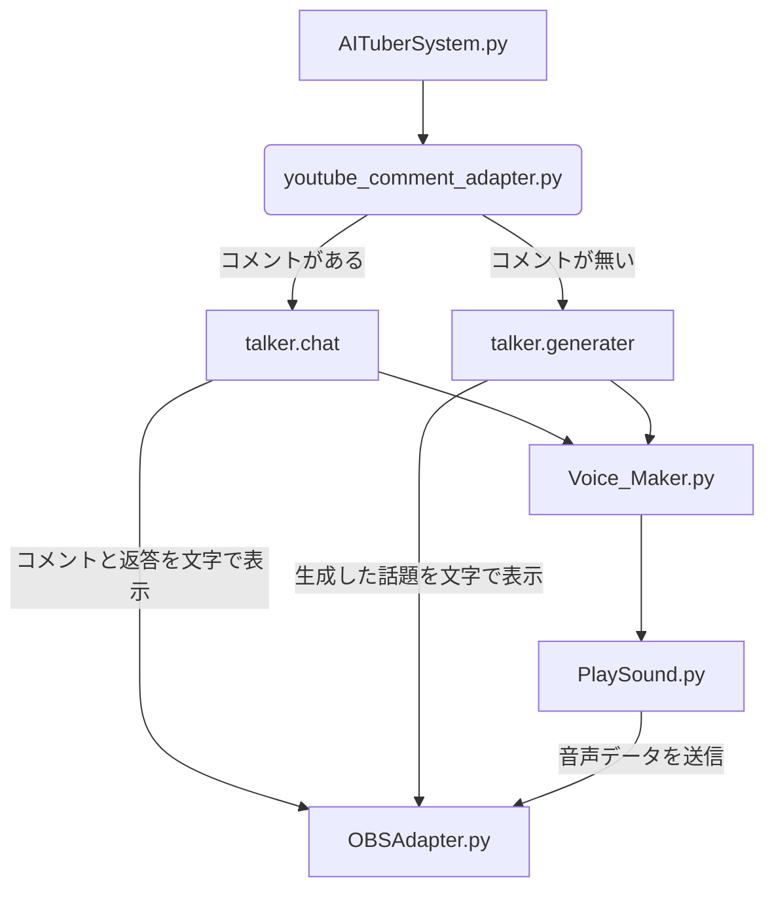

```mermaid
flowchart TD
    start[AITuberSystem.py] --> switch1("youtube_comment_adapter.py")
    switch1 -- コメントがある --> node1[talker.chat]
    switch1 -- コメントが無い --> node2[talker.generater]
    node1 & node2 --> node3[Voice_Maker.py] 
    --> node4[PlaySound.py]
    node1 -- コメントと返答を文字で表示　--> node5
    node2 --生成した話題を文字で表示-->node5
    node4 --音声データを送信--> node5[OBSAdapter.py]
    
```